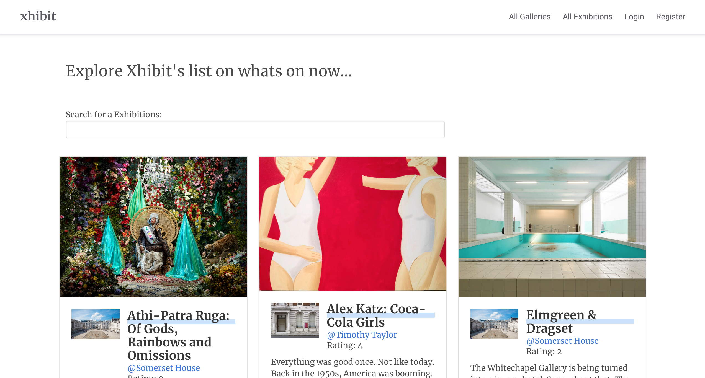
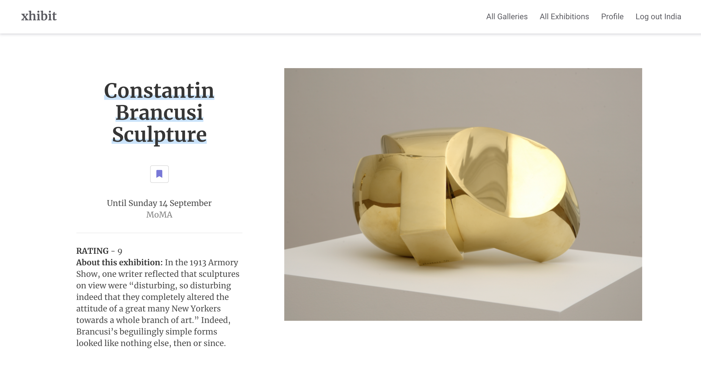
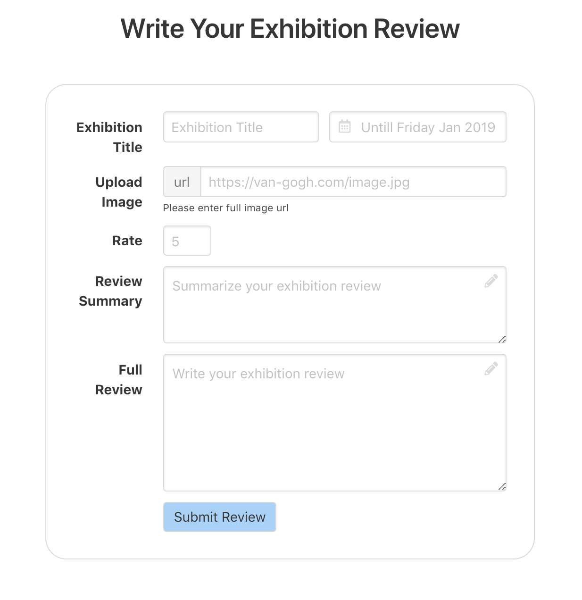
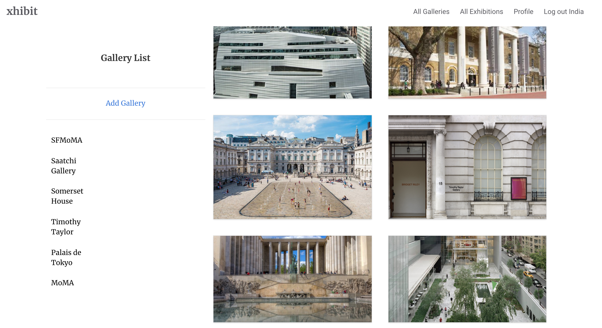
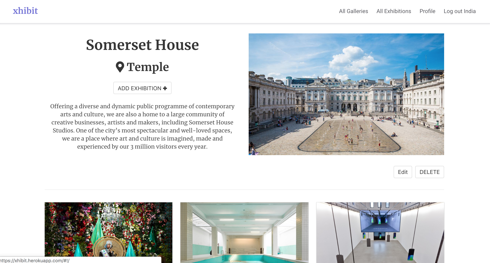
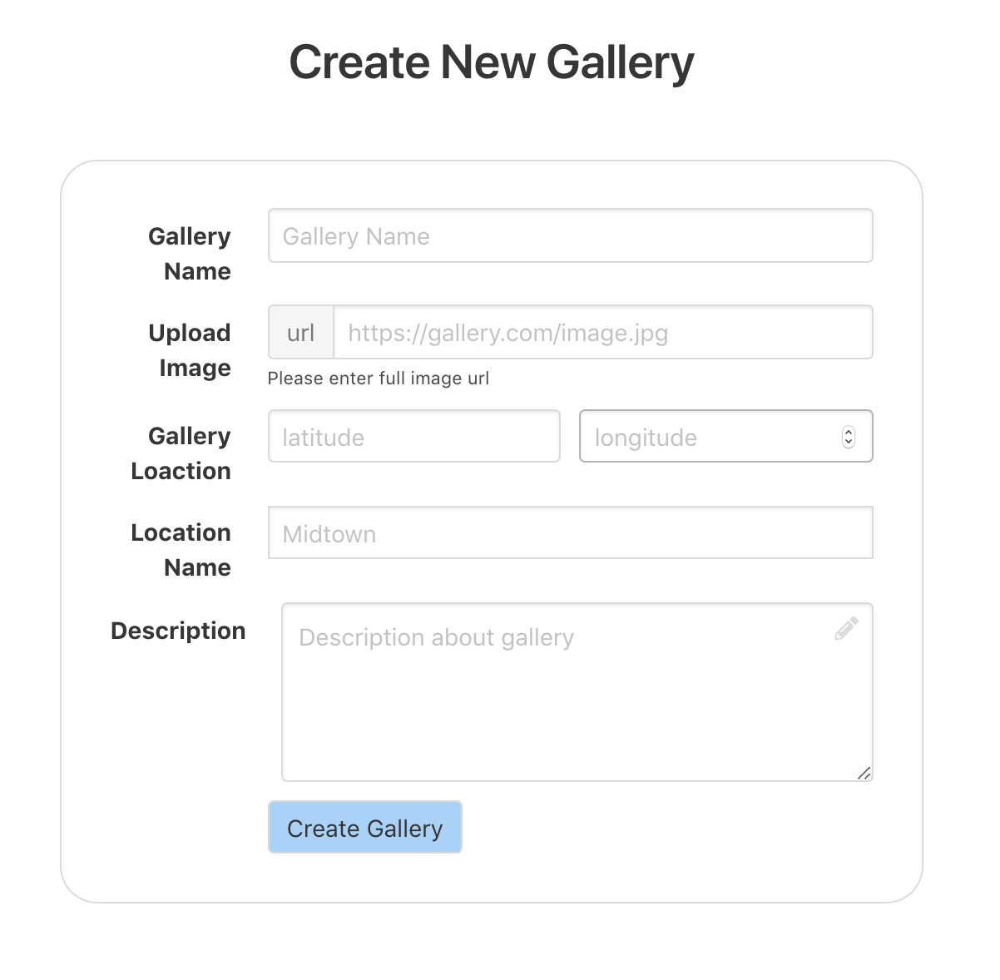
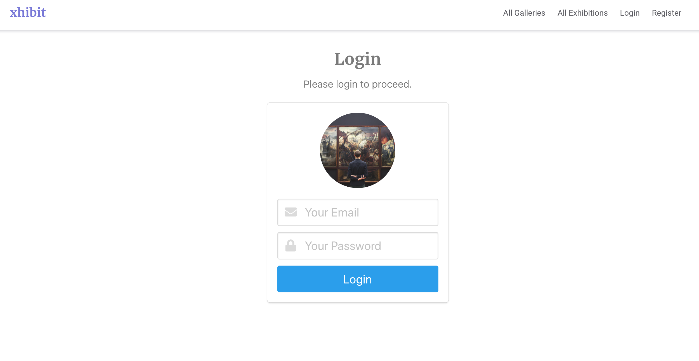
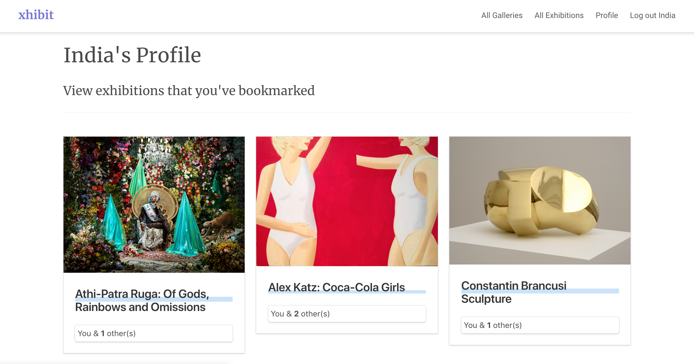

# xhibit

#### Duration: 1 week
Project 3 out of 4 during my Web Development Immersive course at General Assembly.

[View xhibit on Heroku](https://xhibit.herokuapp.com/#!/)

**Note**
- Due to time limitations, we did not plan to make this mobile responsive. For best experience view on a laptop/computer.

***

## Brief
The course instructors had partnered students with other classmates to design and collaboratively build a MEAN (MongoDB, Express, AngularJS, Node.js) stack app of their own design.

> **Server side**
* Use Mongo, Node & Express to build a server-side API
* API must have at least 2 related models, one of which should be a user
* API should include all RESTFUL actions for at least one of those models.
* Include authentication to restrict access to appropriate users
* Include at least one referenced or embedded sub-document
* Include automated tests

> **Client side**
* Use AngularJS
* Use SCSS
* Use Webpack & Yarn** to manage your dependencies and compile your source code

## Concept

A site to list various galleries and the exhibitions that are currently on. Users are able to read reviews, bookmark exhibitions and contribute to comment threads about particular exhibitions.

## How we worked
With only 7 days to fulfil the brief and incorporate our ideas, we made sure we planned everything carefully.

- Time management. MVP focused project management.
- We decided to use Trello Technology to assign tasks and track progress.
- Daily morning stand up and git version control methods were used.

## Visuals

##### All features
> Any user can access:
- Home page: Map interaction, Featured exhibitions filtered by top rated.
- Exhibition index, show and comment threads.
- Gallery index, show.
- Register

> Registered user can access:
- Log in and out
- Create, edit, delete gallery page
- Write exhibition reviews for a specific gallery
- Make comments on exhibition show page
- Bookmark the exhibition review
- View all bookmarks in own user profile page

### Home

### Exhibitions

#### Index

  

#### Show

  

#### New

  

### Galleries

#### Index

  

#### Show

  

#### New

  

### Users

#### Login

  

#### Profile

  

## Project Log

| Time | Action |
| ---- |:------:|
| Thursday ( **half day** ) | Project concept, code planning, wireframe |
| Sunday, Monday, Tuesday ( **3 days**)| Server side work. Initial front end set up. |
| Tuesday, Wednesday (**1.5 days**) | Client side work. Style / Scss. |
| Monday, Thursday (**1.5 days**) | Extra features, Bug fixing, Testing, Git, Deployment |

## Technologies Used
| Category | List |
| ---- | --- |
| Languages                            | Javascript (ECMAScript6), CSS3, Sass, HTML5 |
| Front-end Web Application Framework  | AngularJS |
| Server Environment                   | Node.js with Express.js |
| CSS Framework                        | Bulma |
| Third-party APIs                     | OpenStreetMap with Leaflet |
| Project Collaboration Tool           | Trello, Slack |
| REST client                          | Insomnia |
| Typefaces                            | Google Fonts |
| Text Editor                          | Atom |
| Browser                              | Chrome |
| Version control | Git and GitHub

## License

- **[MIT license](http://opensource.org/licenses/mit-license.php)**

***

## Contact
#### India Derrick
Email : indiaderrick@gmail.com

 [Portfolio](www.indiaderrick.com)| [LinkedIn](https://www.linkedin.com/in/indiaderrick/) | [GitHub](https://github.com/indiaderrick)

#### Jumee Lee
[GitHub](https://github.com/Jumee-LDN)
